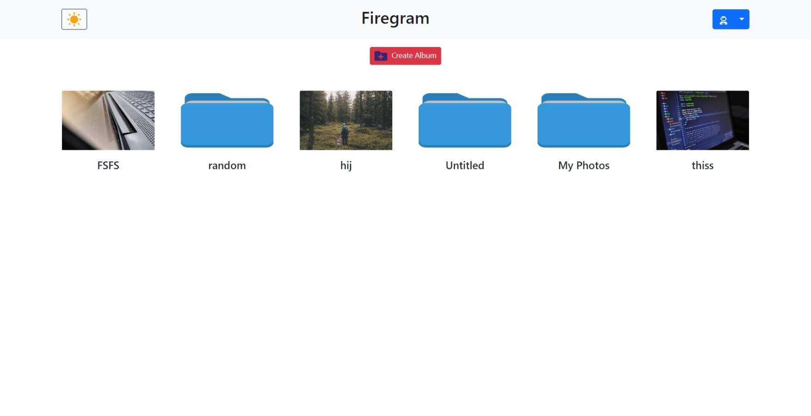
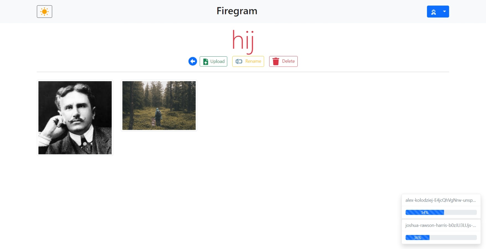

# Firegram 

Firegram is a web application built with React and Firebase that allows users to store and manage their images in the cloud. With Firegram, users can upload images, organize them into nested folders, and access their files from anywhere with an internet connection. This readme will guide you through the setup and usage of the Firegram application.

Live Demo :   https://firegram-akhand.netlify.app/


<div align="center">

<br>
<br>

</div>

## Table of Contents

- [Features](#features)
- [Prerequisites](#prerequisites)
- [Getting Started](#getting-started)
  - [Installation](#installation)
  - [Configuration](#configuration)
- [Usage](#usage)
  - [User Registration](#user-registration)
  - [Uploading Images](#uploading-images)
  - [Managing Folders](#managing-folders)
- [Contributing](#contributing)
- [License](#license)

## Features

Firegram comes with the following features:

- **User Registration**: Users can create an account and sign in to access their image storage.
- **Image Upload**: Upload images to the cloud with ease.
- **Folder Management**: Create and organize folders for better file management.
- **Nested Folders**: Create nested folders to create a structured storage system.
- **Image Preview**: Preview uploaded images.
- **Security**: Built on Firebase, Firegram provides secure authentication and data storage.

## Prerequisites

Before you start using Firegram, you should have the following prerequisites:

- [Node.js](https://nodejs.org/) installed on your system.
- A Firebase project for authentication and cloud storage. You can create one [here](https://console.firebase.google.com/).

## Getting Started

### Installation

1. Clone the Firegram repository to your local machine:

   ```bash
   git clone https://github.com/theakhandpatel/Firebase-gallery.git
   ```

2. Change to the Firegram directory:

   ```bash
   cd Firebase-gallery
   ```

3. Install the project dependencies:

   ```bash
   npm install
   ```

### Configuration

To configure Firebase for the Firegram project, follow these steps:

1. Go to the Firebase Console (https://console.firebase.google.com/).

2. Create a new Firebase project if you haven't already.

3. In your Firebase project, navigate to Project Settings by clicking on the gear icon.

4. Scroll down to the "Your apps" section and click on the web app icon (</>).

5. Give your app a name and click "Register App." Firebase will provide you with a configuration object. Copy this configuration object.

6. In your Firegram project directory, create a file named `.env.local` and set your Firebase configuration as environment variables like this:

   ```env
   REACT_APP_FIREBASE_API_KEY=YOUR_API_KEY
   REACT_APP_FIREBASE_AUTH_DOMAIN=YOUR_AUTH_DOMAIN
   REACT_APP_FIREBASE_PROJECT_ID=YOUR_PROJECT_ID
   REACT_APP_FIREBASE_STORAGE_BUCKET=YOUR_STORAGE_BUCKET
   REACT_APP_FIREBASE_MESSAGING_SENDER_ID=YOUR_MESSAGING_SENDER_ID
   REACT_APP_FIREBASE_APP_ID=YOUR_APP_ID
   ```

7. Save the `.env.local` file.

## Contributing

If you would like to contribute to Firegram, feel free to fork the repository, make your changes, and submit a pull request. We welcome contributions from the community.

## License

This project is licensed under the [MIT License](LICENSE). Feel free to use and modify the code as needed.

Thank you for choosing Firegram as your online image storage service. If you encounter any issues or have questions, please don't hesitate to [contact us](mailto:contact@firegram.com).


## Available Scripts

In the project directory, you can run:

### `npm start`

Runs the app in the development mode.\
Open [http://localhost:3000](http://localhost:3000) to view it in the browser.

The page will reload if you make edits.\
You will also see any lint errors in the console.

### `npm test`

Launches the test runner in the interactive watch mode.\
See the section about [running tests](https://facebook.github.io/create-react-app/docs/running-tests) for more information.

### `npm run build`

Builds the app for production to the `build` folder.\
It correctly bundles React in production mode and optimizes the build for the best performance.
